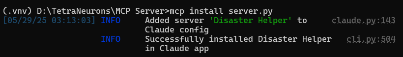
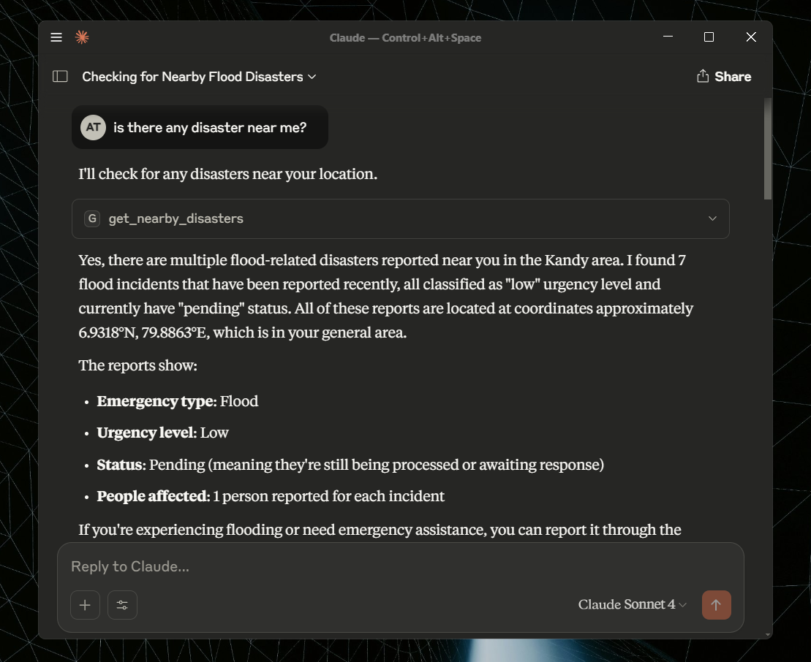

# TetraNeurons 

TetraNeurons is a disaster management application with a React frontend, FastAPI backend, Firebase integration,third-party API & MCP Server support.

---

## Project Setup

### Clone the Repository

```bash
git clone https://github.com/Adhishtanaka/TetraNeurons.git
cd TetraNeurons
```

---

## Frontend Setup

### Install and Run Frontend

```bash
cd frontend
npm install
npm run dev
```

> The frontend will run at: [http://localhost:5173](http://localhost:5173)

### Frontend Environment Configuration

Create a `.env` file in the `frontend/` directory:

```
VITE_OPENWEATHER_API_KEY=12345678901234567890
```

### Trusted Email Domains

For domain verification of roles like government officials and first responders, update `trusted_domain.yaml` in the `backend/` directory:

```yaml
:gov:
  - gov.example.com
  - ministry.gov
first_responders:
  - firedept.org
  - ambulance.org
  - police.org
```

This ensures that only users with approved domains can register as `gov` or `first_responders`. Volunteers and regular users are not domain-restricted.

### Firebase Configuration

In `frontend/arc/services/firebase.ts`, update the `firebaseConfig` object with your Firebase credentials:

```ts
const firebaseConfig = {
  apiKey: "YOUR_FIREBASE_API_KEY",
  authDomain: "YOUR_FIREBASE_AUTH_DOMAIN",
  projectId: "YOUR_FIREBASE_PROJECT_ID",
  storageBucket: "YOUR_FIREBASE_STORAGE_BUCKET",
  messagingSenderId: "YOUR_FIREBASE_MESSAGING_SENDER_ID",
  appId: "YOUR_FIREBASE_APP_ID",
  databaseURL: "YOUR_FIREBASE_DATABASE_URL"
};
```

---

## Backend Setup

### Install and Run Backend

```bash
cd backend

# Create a virtual environment (only first time)
python -m venv .venv

# Activate virtual environment
# On Windows:
.venv\Scripts\activate
# On macOS/Linux:
source .venv/bin/activate

# Install dependencies
pip install -r requirements.txt

# Run FastAPI backend
fastapi dev main.py
```

> The backend will run at: [http://localhost:8000](http://localhost:8000)

### Backend Environment Configuration

Create a `.env` file in the `backend/` directory:

```
JWT_SECRET_KEY=asdfghjklsdfghjcvgbn
GOOGLE_API_KEY=asdfghjklsdfghjcvgbn
```

### Firebase Service Account

Place your Firebase service account file in:

```
backend/serviceAccountKey.json
```

## MCP Server 

This MCP server that provides location-aware disaster response capabilities. This server connects to a disaster management API to help users find nearby emergencies and report assistance needs.

### Tools Available

- `get_nearby_disasters()` - Find disasters near your current location
- `report_emergency(disaster_id, help_text, urgency_type)` - Report emergency assistance needs

### Installation & Usage

### 1. Clone the Repository
```bash
cd MCP Server

# Create a virtual environment (only first time)
python -m venv .venv

# Activate virtual environment
# On Windows:
.venv\Scripts\activate
# On macOS/Linux:
source .venv/bin/activate

# Install dependencies
pip install -r requirements.txt

```
### 2. Create a `.env` File
Create a `.env` file and add your JWT `TOKEN`:


```env
TOKEN=your_jwt_token_here
```

### 3. Run the MCP Server
```bash
mcp install server.py
```




## AI Models (Model Folder)

Also `model/` directory contains files used to train and run models for disaster detection and people counting:

* `best_intellihack_model.pth`: Pre-trained PyTorch model for disaster classification and crowd estimation.
* `IntelliHack.ipynb`: Jupyter notebook used for training and testing the CNN model.
* `yolov8n.pt`: YOLOv8 Nano version weights 
* `yolov9c.pt`: YOLOv9 Compact version weights

## Assumptions 

* **Email Domain Trust**: In our role-based auth Certain roles (e.g. government officials and first responders) must use email domains listed in `trusted_domain.yaml` to signup. Example:

```yaml
:gov:
  - gov.example.com
  - ministry.gov
first_responders:
  - firedept.org
  - ambulance.org
  - police.org
```

Volunteers and general users are not restricted by domain.so we assume Each government agency or first responder department must issue an official email to its personnel.

* **Disaster Location Precision**: We assume each disaster affects an approximate area of **20 km²**, determined using **geohash level 4** for location precision.

* **Reporter Proximity**: Reporters of disasters are assumed to be at the center of the disaster zone.

* **Disaster Task Sending Strategy**:

  * **Small urgency** can be managed by volunteers.
  * **Medium-scale urgency*** are handled primarily by first responders.
  * **Large-scale urgency*** require combined efforts of government bodies and volunteers.
  * This structure ensures volunteer safety while enabling scalable response.

* **Resource Assumption**: All aid resources (e.g., shelters, medication stations) are assumed to be **static** and not mobile.

* **Image Analysis Strategy**:

  * We **do not** use VLMs like CLIP for classification due to high computational cost and low control over label specificity.
  * Instead, a **custom CNN model** is used to classify disaster types and count people—this is faster and cheaper after training.
  * Additionally, we leverage **Gemini Flash 2 API**, a multimodal model, for more robust image understanding.

* **Weather Data**:

  * We use the **OpenWeather API** for Map precipitation data filter relevant to disasters.
  * Although the API allows only **60 calls per minute**, this is considered acceptable under expected usage.

---

## AI Workflow Architecture

### Workflow 1: Multiagent Emergency Report Analysis
**Triggered**: When first emergency call/photo is submitted
**Purpose**: Create government and citizen reports, predict future impact, validate request authenticity

#### Multiagent Architecture:
**3 AI Agents (Independent Decision Makers):**
- **Computer Vision AI Agent**: Analyzes emergency photos using CNN + YOLO models
- **Government Analysis AI Agent**: Creates official response reports using Gemini AI
- **Citizen Survival AI Agent**: Generates public safety instructions using Gemini AI

**2 Data Collection Tools:**
- **Weather Tool**: Gets current conditions (Open-Meteo API)
- **Disaster History Tool**: Fetches past disasters (GDAC API)

**5 System Coordinators:**
- **Parallel Data Coordinator**: Runs weather + history tools simultaneously
- **Data Validation Coordinator**: Checks data quality and completeness
- **Parallel AI Coordinator**: Runs government + citizen agents simultaneously
- **Final Review Coordinator**: Evaluates all outputs for acceptance/rejection
- **Master Coordinator**: Orchestrates entire multiagent workflow

#### Multiagent Interaction Flow:
```
Emergency Photo → Computer Vision Agent (independent analysis)
                        ↓
Parallel Data Collection → Weather Tool + History Tool (simultaneous)
                        ↓
Data Validation → Quality check by validation coordinator
                        ↓
Parallel AI Analysis → Government Agent + Citizen Agent (simultaneous)
                        ↓
Final Coordination → Master coordinator reviews all agent outputs → Decision
```

**Agent Collaboration**: Each AI agent works independently on specialized tasks while coordinators manage data flow, timing, and final decision-making across all agents.


---

### Workflow 2: Task Creation & Dispatch
**Triggered**: When government accepts the emergency report
**Purpose**: Create specific tasks for responders and dispatch them

#### Components:
- **Disaster Context Fetcher**: Gets emergency details from database
- **AI Task Generator**: Creates specific responder instructions (Gemini 2.0)
- **Task Dispatcher**: Assigns tasks to appropriate responders

#### Process Flow:
```
Government Approval → Disaster Lookup → Resource Discovery → 
Task Generation → Responder Assignment → Task Dispatch
```

---

### Workflow 3: Additional Help Requests
**Triggered**: When other people in the same disaster area request help
**Resource Finder**: Locates nearby hospitals, shelters, supplies
**Purpose**: Add new tasks for existing disaster without full analysis

#### Components:
- **Help Request Processor**: Validates new help requests
- **Existing Disaster Linker**: Links request to ongoing disaster
- **Quick Task Generator**: Creates tasks based on existing disaster context (Gemini 2.0)
- **Task Adder**: Adds new tasks to existing response effort

#### Process Flow:
```
Help Request → Link to Existing Disaster → Quick Task Generation → 
Add to Task Queue → Responder Assignment
```

## 🔗 Workflow Integration

```
Workflow 1: Emergency Report → Government Review → Approval
                                    ↓
Workflow 2: Task Creation → Responder Dispatch → Active Response
                                    ↓
Workflow 3: Additional Help Requests → More Tasks → Extended Response
```

## Notes

* Be sure to **replace the provided API keys and secrets with your own** in production.
* The app includes disaster-related data visualization, user authentication, and real-time alerts.

---

## License

MIT License
